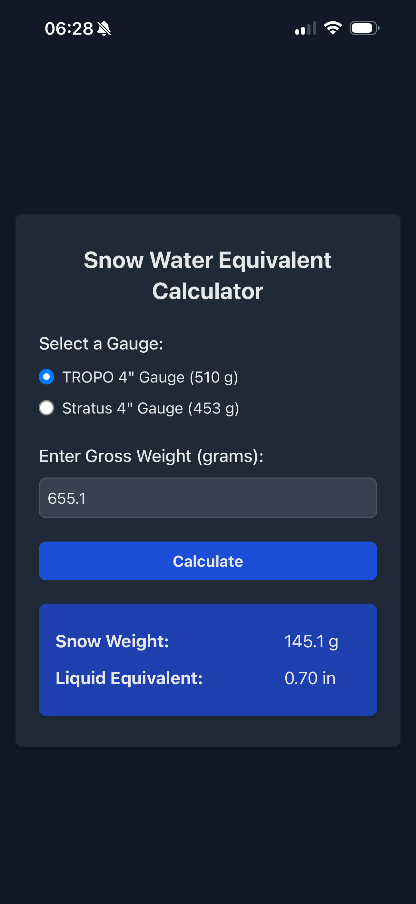

# CoCoRaHS SWE Calculator
A simple web app to calculate snow water equivalent from the weight CoCoRaHS approved 4” rain gauges.



## Local Installation

### Docker
```bash
git clone https://github.com/HumphreysCarter/CoCoRaHS-SWE-Calculator.git

cd CoCoRaHS-SWE-Calculator

docker run -d \
  --name CoCoRaHS-SWE-Calculator \
  -p 8000:80 \
  -v $(pwd)/src:/usr/share/nginx/html:ro \
  nginx:alpine
```